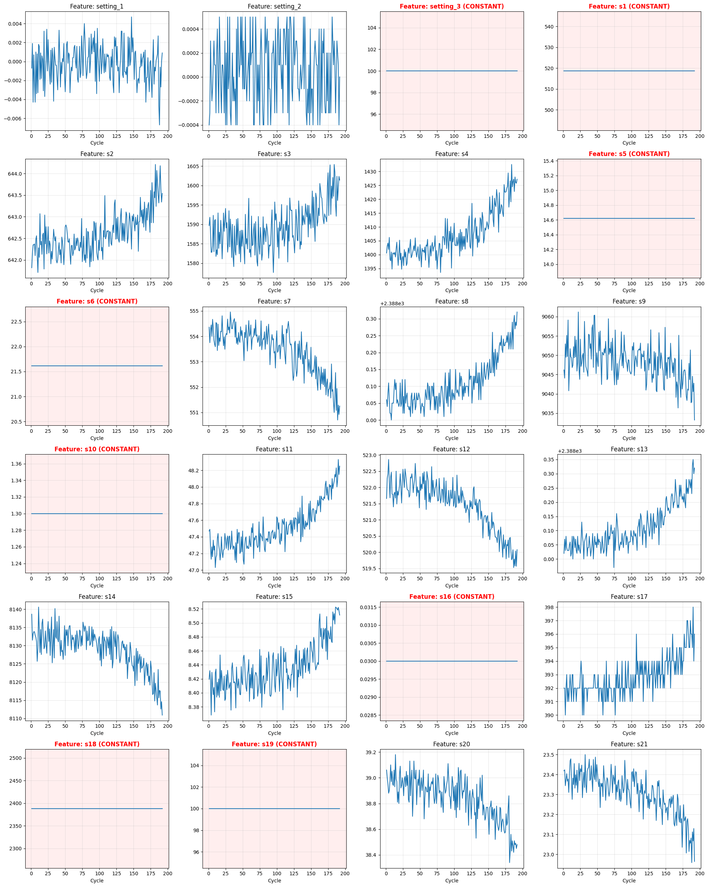

# Predictive Maintenance for Aircraft Engines: RUL Estimation

This repository explores multiple probabilistic and machine learning approaches to predict the **Remaining Useful Life (RUL)** of aircraft engines using the **NASA C-MAPSS** dataset. The project transitions from foundational Bayesian models to complex temporal architectures to optimize for both accuracy and safety-critical risk management.

## 1. Business Problem

Aircraft engine maintenance traditionally relies on **scheduled inspections** or **reactive replacement**. Both methods are inefficient: reactive maintenance risks catastrophic failure, while preventive maintenance often replaces healthy components prematurely.

Predicting **Remaining Useful Life (RUL)** enables **Predictive Maintenance**, allowing operators to:
* Schedule maintenance precisely before failure.
* Reduce operational disruptions and safety risks.
* Optimize maintenance costs and component longevity.

### Dataset: NASA C-MAPSS
We utilize the **FD001** turbofan degradation dataset, which includes:
* **100 engines** run to failure for training.
* **21 sensor variables** and **3 operational settings**.
* High-noise, non-linear degradation trajectories.

---

## 2. EDA (Exploratory Data Analysis)

Exploratory analysis was conducted to identify degradation signals across 21 sensors. Key findings include:
* **High Correlation Sensors**: Sensors 11, 4, 12, 7, and 15 show strong monotonic trends (|r| > 0.64) with RUL.
* **Feature Redundancy**: 8 sensors were identified as constant (zero variance) and removed to reduce model noise.
* **Degradation Patterns**: Most engines exhibit a "healthy" initial phase followed by an accelerating degradation phase, motivating the use of **Piecewise RUL labeling**.


*(Note: Placeholder for EDA visualization showing sensor trends vs. RUL cycles)*

---

## 3. Modeling & Technical Analysis

The project implements a progression of models, moving from static Bayesian inference to dynamic temporal sequences.

### [Hierarchical Bayesian Model](./notebooks/hierarchical_bayesian_model(hbm)/README.md)
#### Target Transformation

To stabilize variance, the target variable is transformed as:

$$
y = \log(1 + RUL)
$$

Predictions are later mapped back to the original RUL scale using the inverse transformation.

#### Features

The model uses operational settings and sensor measurements:

- Operational settings (`setting_1–3`)
- Sensor readings (`s1–s21`)
- Engine cycle index
- First-order sensor differences (`sensor_diff`)

Sensor differences help capture degradation trends across cycles.

#### Model

We assume a Student-t observation model:

$$
y_i \sim \text{StudentT}(\nu, \mu_i, \sigma)
$$

with linear predictor:

$$
\mu_i = \alpha + X_i \beta
$$

where $\alpha$ is the intercept, $X_i$ the feature vector, and $\beta$ the regression coefficients.

#### Hierarchical Priors

We propose the following priors:

$$
\nu \sim \text{Exponential}(1/10), \quad
\sigma \sim \text{HalfNormal}(1), \quad
\alpha \sim \mathcal{N}(0, 1), \quad  
\beta_j \sim \mathcal{N}(0,\tau^2), \quad
\tau \sim \text{HalfNormal}(1)
$$

#### Inference

Posterior inference is performed using the **No-U-Turn Sampler (NUTS)**, generating posterior predictive distributions that provide both RUL estimates and uncertainty intervals.

#### Conslusion

Hierarchical Abyesian turns out to be a foundational approach using **Student-t Likelihood** and **NUTS sampling** to quantify prediction uncertainty, and It employs hierarchical shrinkage to stabilize sensor coefficients but is limited by its linear mean structure.

### [Dynamic Bayesian Network (DBN) and Unscented Kalman Filter (UKF)](./notebooks/dynamic_bayesian_network_(dbn)/README.md)
While excellent for tracking hidden health states, these models struggled with the exponential penalty of the NASA Score due to their reliance on rigid process models.

#### Dynamic Bayesian Network (DBN)
The DBN is a graphical model that captures temporal and instantaneous dependencies between operational settings and sensor readings.

- The network architecture contains 34 nodes and 77 edges across two time slices.
- Continuous features were discretized into 5 bins using quantile binning to facilitate the model.
- This approach yields high interpretability for understanding sensor relationships but loses fine-grained information due to discretization.


#### Unscented Kalman Filter (UKF)
The UKF is a recursive Bayesian filter used to estimate the hidden health state of an engine from noisy sensor observations.

- The advanced "Mark II" implementation uses PCA to compress 14 sensors into 2 principal components.
- Degradation is modeled using an exponential decay function defined by the following state equations:

$$x(t + 1) = x(t) - \text{decay} \times dt$$

$$\text{decay} = \text{baseline} \times \exp(\text{curvature} \times (1 - x(t)))$$

The UKF tracks engine health continuously but is highly sensitive to hyperparameters like baseline and curvature.

#### Results
- The DBN achieved a mean accuracy of roughly 52.6% for predicting 5-bin sensor states.

- The UKF Mark II model achieved a Root Mean Square Error (RMSE) of 35.85 on the test set.


- The UKF scored 3,311.77 on the official CMAPSS evaluation metric.

- The CMAPSS scoring function heavily penalizes late RUL predictions compared to early predictions.

- Both models struggle significantly with outlier engines that fail unexpectedly early.
### [LSTM & GRU](./notebooks/time_series_models)
Standard **Recurrent Neural Network** architectures designed to capture long-term dependencies in sensor time series.

### [Bayesian Time Series Model (BSTS)](./notebooks/bayesian_time_series_model(bsts)/README.md)

**Input Features**: 8 sensors (temperature, pressure, speed) + cycle number (RUL Cap of 120) 

**BSTS Architecture**: 5× Random Forest (100 trees each, max_depth=20) + Gradient Boosting quantiles  
**Kalman Filter Parameters**: Q=0.05, R=1.0, constrained health ∈ [0,1.2]
  - The H Matrix - The Sensor Connection to Health
  - Q Matrix (Process Noise) - How uncertain are we about the degradation model?
  - R Matrix (Measurement Noise) - How noisy are the sensors?

## Two BSTS Approaches Tested
 
### **1. Kalman Filter (Physics-Based)**
**Idea**: Track hidden "health" state using sensor measurements
```
State: [health, degradation_rate]
health(t+1) = health(t) - rate
RUL = health / rate
```
 
**Benefits and Drawbacks:**
- Interpretable (explicit health tracking)
- Requires extensive tuning (Q, R, H matrix)
- Assumes linear relationships
 
### **2. BSTS (Data-Driven Ensemble)**
**Idea**: Ensemble of 5 Random Forests + quantile regression for uncertainty
```
5 RF models → mean prediction
Quantile regression → 80% confidence intervals
```
 
**Benefits and Drawbacks**:
- Captures non-linear sensor patterns
- Robust with default parameters
- Ensemble provides natural uncertainty

 ## Results
 
/comparison_scatter.png)
 
| Metric | Kalman Filter | BSTS | Winner |
|--------|---------------|------|--------|
| **RMSE** | 77.80 cycles | **19.51 cycles** | **BSTS (4× better)** |
| **NASA Score** | 4,335,314 | **2,067** | **BSTS (2,097× better)** |
| **80% CI Coverage** | 26% | 65% | **BSTS** |
 
### **Key Visual Insights**
 
**Left (Kalman)**: Predictions collapsed near zero - failed to track degradation  
**Right (BSTS)**: Strong correlation with true RUL across full range

**Key Takeaway**: BSTS achieved competitive performance (RMSE=19.51) with robust uncertainty quantification, outperforming the tuned Kalman Filter by 4×.

### [Prophet](./notebooks/prophet_model/README.md)
An **additive regression model** that treats RUL prediction as a curve-fitting problem. It offers a strong balance between simplicity and performance, performing nearly as well as more complex deep learning models.

This module applies **Meta's Prophet** — a Bayesian structural time-series model — to the task of **Remaining Useful Life (RUL) prediction** for aircraft turbofan engines, using the NASA C-MAPSS FD001 benchmark dataset.

Prophet was originally designed for calendar-driven business forecasting. Here, it is repurposed as a **Bayesian regression framework** by disabling all seasonality components and driving predictions entirely through 18 sensor and operational-setting regressors. Two growth modes are explored and compared:

| Model | Prophet Growth Mode | Core Idea |
|-------|---------------------|-----------|
| **Linear Trend** | `linear` | Piece-wise linear degradation trend; predictions clipped to `[0, 125]` post-inference |
| **Logistic Trend** | `logistic` | Saturating growth with explicit floor and cap enforces bounded RUL predictions natively |

The work sits within a broader **Bayesian ML group project** at the University of Chicago, where five methods are compared side-by-side on the same dataset.

---


## Model Architecture

Prophet decomposes the target signal into additive components:

$$y(t) = g(t) + s(t) + h(t) + \boldsymbol{\beta}^\top \mathbf{x}(t) + \varepsilon_t$$

| Component | Symbol | Role in this application |
|-----------|--------|--------------------------|
| Trend | $g(t)$ | Captures the engine's underlying degradation trajectory |
| Seasonality | $s(t)$ | **Disabled** — no calendar effects in mechanical data |
| Holidays | $h(t)$ | **Disabled** |
| External regressors | $\boldsymbol{\beta}^\top \mathbf{x}(t)$ | All 18 sensor/setting features drive the prediction |
| Noise | $\varepsilon_t$ | Gaussian observation noise |

### Model 1 — Linear Trend

```python
Prophet(
    growth="linear",
    yearly_seasonality=False,
    weekly_seasonality=False,
    daily_seasonality=False,
    changepoint_prior_scale=0.05
)
```

The trend $g(t)$ is modeled as a **piece-wise linear function**:

$$g(t) = (k + \mathbf{a}(t)^\top \boldsymbol{\delta})\,t + (m + \mathbf{a}(t)^\top \boldsymbol{\gamma})$$

where $k$ is the base growth rate, $\boldsymbol{\delta}$ are changepoint adjustments, and $\mathbf{a}(t)$ is an indicator vector for active changepoints. Predictions are post-hoc clipped to $[0,\ 125]$.

### Model 2 — Logistic (Non-Linear) Trend

```python
Prophet(
    growth="logistic",
    yearly_seasonality=False,
    weekly_seasonality=False,
    daily_seasonality=False,
    changepoint_prior_scale=0.05
)
```

The trend is replaced by a **saturating logistic function**:

$$g(t) = \frac{L}{1 + e^{-(k + a(t)^\top \boldsymbol{\delta})(t - (m + a(t)^\top \boldsymbol{\gamma}))}}$$

- `cap = 125` (= `RUL_CAP`) is passed as a column in the DataFrame, enforcing the natural upper bound.
- `floor = 0` prevents negative predictions natively at the model level.
- This eliminates the need for post-hoc output clipping.

---


## Final Results

Evaluation is performed on the **FD001 test set** (100 engines). For each engine, only the **final cycle's prediction** is compared against the ground-truth RUL.

### Metrics Summary

| Model | Split | MAE | RMSE | NASA Score |
|-------|-------|-----|------|------------|
| Linear Trend | Train | 14.08 | 18.55 | — |
| Linear Trend | **Test** | **17.84** | **22.62** | **1289.23** |
| Logistic Trend | Train | 14.50 | 19.04 | — |
| Logistic Trend | **Test** | **17.91** | **22.69** | **1265.46** |

> Run the notebook to populate exact values — outputs are printed to cell stdout.

### NASA Scoring Function

An asymmetric penalty that weights **under-prediction** (late maintenance warning) more harshly than over-prediction:

$$S = \sum_{i=1}^{N} \begin{cases} e^{-d_i/13} - 1 & \text{if } d_i < 0 \quad \text{(early prediction)} \\ e^{\,d_i/10} - 1 & \text{if } d_i \geq 0 \quad \text{(late prediction)} \end{cases}$$

where $d_i = \hat{y}_i - y_i$. A **lower score is better**.

### [Bayesian Recurrent Neural Network (BRNN)](./notebooks/bayesian_recurrent_neural_network(brnn)/README.md) — **Best Performing Model**
Our most advanced architecture, combining **CNN, Attention, and LSTM** layers with **Monte Carlo Dropout**. This model treats RUL prediction as a risk-aware optimization task, utilizing a custom **Asymmetric NASA Loss** and 3-D Calibration to minimize costly "late predictions."

The solution is a multi-stage pipeline:

| Stage | Component | Purpose |
|-------|-----------|---------|
| **1** | Piecewise RUL + RobustScaler + Sliding Window | Physically-grounded feature engineering |
| **2** | CNN-Attention-LSTM with Output Clamping | Temporal & spatial degradation feature extraction |
| **3** | RUL-Weighted + Asymmetric NASA Loss | Safety-aware training objective |
| **4** | MC Dropout (Bayesian Inference) | Quantified prediction uncertainty |
| **5** | 3-D Grid Search Calibration | Post-hoc risk-minimising decision strategy |


The model architecture is a **three-stage hybrid neural network** that processes sensor time-series through local extraction, global attention, and temporal memory in sequence.

```
Input (Batch, 30, 17)
      │
      ▼
┌─────────────────────────────────────────────┐
│  Module 1 · 1D-CNN                          │
│  Conv1d → ReLU → BatchNorm                  │
│  Local feature & trend extraction           │
│  (automated rolling-feature equivalent)     │
└────────────────────┬────────────────────────┘
                     │
                     ▼
┌─────────────────────────────────────────────┐
│  Module 2 · Multi-Head Attention (4 heads)  │
│  Input shape: (Seq_len, Batch, Embed_dim)   │
│  Global inter-feature dependency learning   │
│  (which cycles matter most?)                │
└────────────────────┬────────────────────────┘
                     │
                     ▼
┌─────────────────────────────────────────────┐
│  Module 3 · Bi-layer LSTM                   │
│  Long-term degradation history modelling    │
│  (remembers healthy → failure trajectory)   │
└────────────────────┬────────────────────────┘
                     │
                     ▼
┌─────────────────────────────────────────────┐
│  Module 4 · Bayesian FC Head (MC Dropout)   │
│  Linear(hidden, 64) → ReLU → Dropout        │
│  Linear(64, 1)                              │
└────────────────────┬────────────────────────┘
                     │
                     ▼
         torch.clamp(output, 0.0, 130.0)
         ← Physical ceiling constraint →
```


> **Final Performance:** NASA Score `1,138.28` · RMSE `24.3 cycles`

---

## 4. Conclusion & Project Evolution

### The Technical Journey
Our research followed a deliberate evolution based on performance feedback:
1.  **Phase 1 (Foundational Bayesian)**: We initially deployed **HBM** and **DBN**. While mathematically elegant, they struggled to capture the rapid, non-linear changes in engine degradation, leading to poor **NASA Scores**.
2.  **Phase 2 (Time Series Shift)**: We pivoted toward **Time Series** specific models. We discovered that capturing the temporal "momentum" of sensors was key. Traditional time series concepts allowed us to better track the accelerating wear-and-tear phase.
3.  **Phase 3 (Optimization & Complexity)**: This led to the development of **BSTS**, **Prophet**, and **BRNN**. 

### Model Performance Comparison

| Model | RMSE | NASA Score | Characteristics |
| :--- | :--- | :--- | :--- |
| **BRNN** | **24.30** | **1,138.28** | Best Performance; High Complexity; Bayesian Uncertainty |
| **Prophet** | 22.69 | 1265.47 | High Efficiency; Excellent baseline; Easy to tune |
| **BSTS** | 19.51 | 2,067.00 | Robust Ensemble; Good Uncertainty Calibration |
| **UKF (Mark II)** | 35.85 | 3,311.77 | Physics-based; Sensitive to hyperparameters |

### Final Insights
* **The SOTA vs. Simplicity Trade-off**: **BRNN** is our best model, offering the most sophisticated risk mitigation via MC Dropout. However, **Prophet** provides a surprisingly competitive alternative. For industrial applications where deployment speed and interpretability are paramount, Prophet is a highly viable candidate.
* **Risk Management > Precision**: Our journey proved that minimizing **NASA Score** (avoiding late predictions) requires a different strategy than minimizing **RMSE**. Incorporating "pessimism" into the model calibration is essential for aviation safety.

---

## 5. Contributors
* **[Ryan Chen](https://github.com/RyanChenJung)**
* **[Aditya Singh](https://github.com/asingh49-cmd)**
* **[Mukul Ramesh](https://github.com/MukulRamesh)**
* **[William Niu](https://github.com/williamniu)**
* **[Eduardo Tovilla](https://github.com/Eduardo-Tovilla)**

---
*Last Updated: March 2026*
